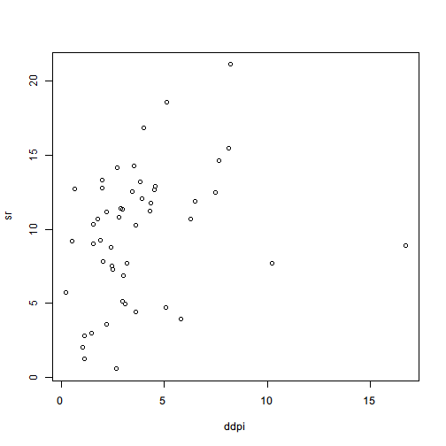

# Formula

Formula is an object used to represent an relationship between two sets of symbols. A formula is often created with `~` like `z ~ x + y`. It has no meaning unless a function interprets it. The most commonly seen usage of a formula is in `lm` function that performs a linear regression.

Note that it is the function that interprets what the formula means. The following example shows different meanings when you write the formula in different ways.

The following example works with a built-in dataset named `LifeCycleSavings`. We can load it with `data()` function.


```r
> data(LifeCycleSavings)
```

From the documentation, we know that this dataset is the intercountry life-cycle savings data with the following structure:

| Column | Type    | Description                       |
|--------|---------|-----------------------------------|
| `sr`   | numeric | aggregate personal savings        |
| `pop15`| numeric | % of population under 15          |
| `pop75`| numeric | % of population over 75           |
| `dpi`  | numeric | real per-capita disposable income |
| `ddpi` | numeric | % growth rate of dpi              |

Once the data is loaded into the environment, we can run a series of linear regressions by `lm()` function under different settings. Here we only demonstrate how `lm()` interprets different formulas. We will go into details of linear model fit in later chapters.

If we want to build a linear model in which `pop15`, `pop75`, `dpi` and `ddpi` are used to explain `sr`, we can construct a formula to represent it.


```r
> lm(sr ~ pop15 + pop75 + dpi + ddpi,data=LifeCycleSavings)
```

```

Call:
lm(formula = sr ~ pop15 + pop75 + dpi + ddpi, data = LifeCycleSavings)

Coefficients:
(Intercept)        pop15        pop75          dpi         ddpi  
 28.5660865   -0.4611931   -1.6914977   -0.0003369    0.4096949  
```

Since formula is simply an object, we can create it and pass it around, fit a linear model, and read its summary.


```r
> formula1 <- sr ~ pop15 + pop75 + dpi + ddpi
> model1 <- lm(formula1,data=LifeCycleSavings)
> summary(model1)
```

```

Call:
lm(formula = formula1, data = LifeCycleSavings)

Residuals:
    Min      1Q  Median      3Q     Max 
-8.2422 -2.6857 -0.2488  2.4280  9.7509 

Coefficients:
              Estimate Std. Error t value Pr(>|t|)    
(Intercept) 28.5660865  7.3545161   3.884 0.000334 ***
pop15       -0.4611931  0.1446422  -3.189 0.002603 ** 
pop75       -1.6914977  1.0835989  -1.561 0.125530    
dpi         -0.0003369  0.0009311  -0.362 0.719173    
ddpi         0.4096949  0.1961971   2.088 0.042471 *  
---
Signif. codes:  0 '***' 0.001 '**' 0.01 '*' 0.05 '.' 0.1 ' ' 1

Residual standard error: 3.803 on 45 degrees of freedom
Multiple R-squared:  0.3385,	Adjusted R-squared:  0.2797 
F-statistic: 5.756 on 4 and 45 DF,  p-value: 0.0007904
```

Note that the regression includes the intercept by default. We can make it explicit in the formula:

```r
lm(sr~1+pop15+pop75+dpi+ddpi,data=LifeCycleSavings)
```

If we need to avoid the intercept in the regression equation, we can put a zero intercept in the formula


```r
> lm(sr~0+pop15+pop75+dpi+ddpi,data=LifeCycleSavings)
```

```

Call:
lm(formula = sr ~ 0 + pop15 + pop75 + dpi + ddpi, data = LifeCycleSavings)

Coefficients:
   pop15     pop75       dpi      ddpi  
0.091723  1.713944  0.000263  0.553164  
```

or equivalently use `-1` to remove the intercept.

```r
lm(sr~pop15+pop75+dpi+ddpi-1,data=LifeCycleSavings)
```

If there are too many regressors, it can be time-consuming to write them down. We can use `.` to represent all the resting columns.


```r
> lm(sr~.,data=LifeCycleSavings)
```

```

Call:
lm(formula = sr ~ ., data = LifeCycleSavings)

Coefficients:
(Intercept)        pop15        pop75          dpi         ddpi  
 28.5660865   -0.4611931   -1.6914977   -0.0003369    0.4096949  
```

If there are many regressors, but we need all the rest columns except a few of them, we can append the formula with some "negative" terms to remove some of those represented by `.`.


```r
> lm(sr~.-ddpi,data=LifeCycleSavings)
```

```

Call:
lm(formula = sr ~ . - ddpi, data = LifeCycleSavings)

Coefficients:
(Intercept)        pop15        pop75          dpi  
 31.4573811   -0.4921418   -1.5676746   -0.0008336  
```

Linear model can be extended to log-linear model. It is very easy to make such transformation: just add `log()` function to the terms we need.


```r
> lm(log(sr)~log(pop15)+log(pop75)+log(dpi)+ddpi,data=LifeCycleSavings)
```

```

Call:
lm(formula = log(sr) ~ log(pop15) + log(pop75) + log(dpi) + ddpi, 
    data = LifeCycleSavings)

Coefficients:
(Intercept)   log(pop15)   log(pop75)     log(dpi)         ddpi  
   10.01822     -2.11067     -0.41372     -0.06694      0.06052  
```

It is very handy to add interactive terms with `*`.


```r
> lm(sr~pop15*pop75+dpi,data=LifeCycleSavings)
```

```

Call:
lm(formula = sr ~ pop15 * pop75 + dpi, data = LifeCycleSavings)

Coefficients:
(Intercept)        pop15        pop75          dpi  pop15:pop75  
 29.6557873   -0.4375947   -0.5266596   -0.0008829   -0.0349562  
```

If we want to transform the data before fitting, we can call `I()` at the transformed regressor to avoid `lm()` misinterprets the term as  formula transformation.


```r
> lm(sr~pop15+I(pop15^2)+pop75+I(pop75^2)+dpi+ddpi,data=LifeCycleSavings)
```

```

Call:
lm(formula = sr ~ pop15 + I(pop15^2) + pop75 + I(pop75^2) + dpi + 
    ddpi, data = LifeCycleSavings)

Coefficients:
(Intercept)        pop15   I(pop15^2)        pop75   I(pop75^2)  
 40.0774710   -0.9541289    0.0061924   -3.7823499    0.3435570  
        dpi         ddpi  
 -0.0003702    0.4407162  
```

All above examples are the formula interpreted by `lm()` function. The interpretation is not by definition true for all functions. In fact, every function can define its own ways to interpret a formula which, in essence, nothing more than a pair expressions connected with `~`.

Another example to show how different functions interpret formulas in different ways is `plot()` function.


```r
> plot(sr~ddpi,data=LifeCycleSavings)
```

 

The formula to plot is interpreted as *plot `sr` as y-axis and `ddpi` as x-axis*. It is consistent with our experience in mathematics when we write an equation $y = f(x)$ in which the left-hand side usually represents the y-axis, and the right-hand side the x-axis.

Some functions in other packages also accept formula as an argument and the interpretation almost follow the same conventions, which makes it easy to use and learn. In later chapters, we will see how formula is used by `reshape2` package to transform data format.
